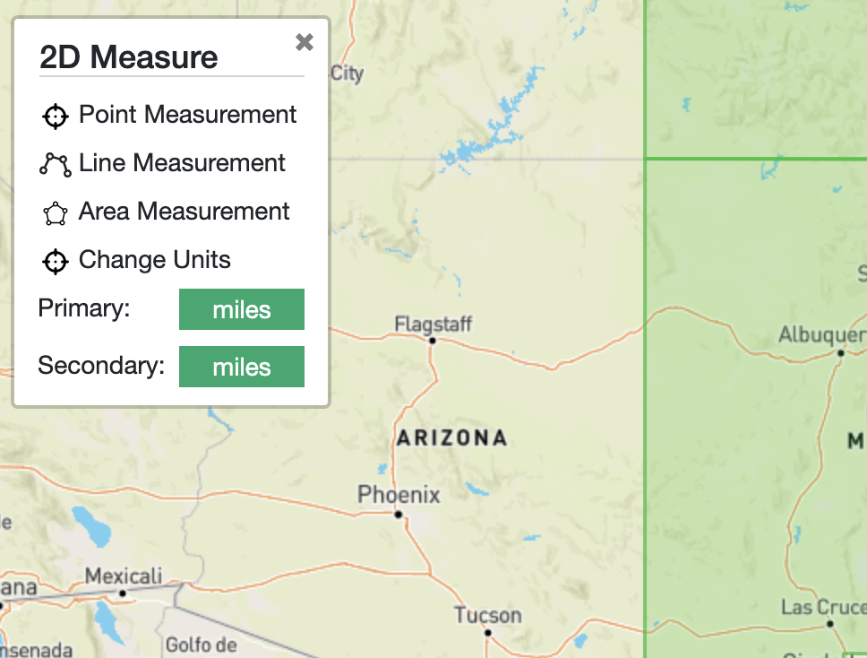

# leaflet.multiMeasure
2D Area/Length/Coordinate Measure Plugin for Leaflet

Inspired by the original Leaflet Measure - https://github.com/ljagis/leaflet-measure

__In Progress, Needs Final Touchup and WriteUp__

Due to a lack of activty on the original measure repo and a personal curiousity, I rebuilt this plugin with certain enhancements:
- Removes use of unsafe-eval
- Breaks out Measurements into seperate Point/Line/Area
- Adds last action history, Undo Last action

Future upgrades:
- Edit vertexes on saved measurements. 

This a weekend project, updates are imminent the next time it rains :) The goal is to set a new standard for the Leaflet Measure Tool plugin and hopefully get listed on the Leaflet Official Plugins. 

User can select draw type, aka you can make a 9 pointed polyline without auto-converting measurements to a closed polygon after 2 points.

